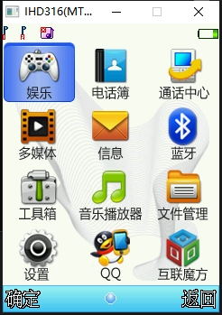
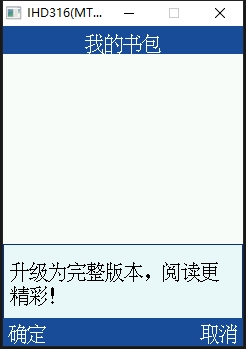
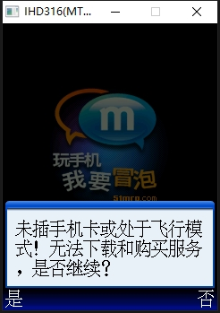
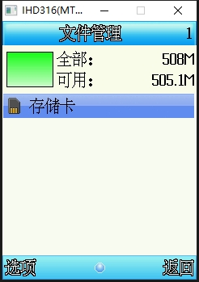

# 基于Unicorn Engine的手机固件模拟器
### 使用的是手机型号IHD 316的固件，手机搭载CPU为MT6252

### 已实现

- LCD显示功能
- 按键功能
- 储存功能

### 部分实现功能
- SIM卡模拟
### 未实现功能
- 摄像机模拟
- 声音播放
- 网络通信

# 编译环境

- mingw32

# 编译

- 双击build.bat文件

# 说明

- bin/Rom目录下的08000000.bin就是手机的固件导出
- fat32.img为SD卡镜像文件，需要手动点击bat生成并移动到bin/Rom目录下

# 按键映射
### 数字按键为键盘上左侧数字按键，不是右侧的NumPad数字按键
- W 映射 上
- S 映射 下
- A 映射 左
- D 映射 右
- Q 映射 左确认
- E 映射 右返回
- 0 映射 0
- 1 映射 1
- 2 映射 2
- 3 映射 3
- 4 映射 4
- 5 映射 5
- 6 映射 6
- 7 映射 7
- 8 映射 8
- 9 映射 9
- C 映射 挂机键
- Z 映射 拨号键
- N 映射 *键
- M 映射 #键